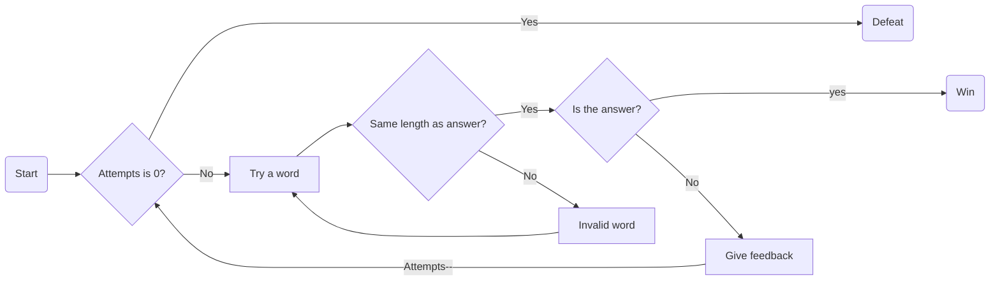
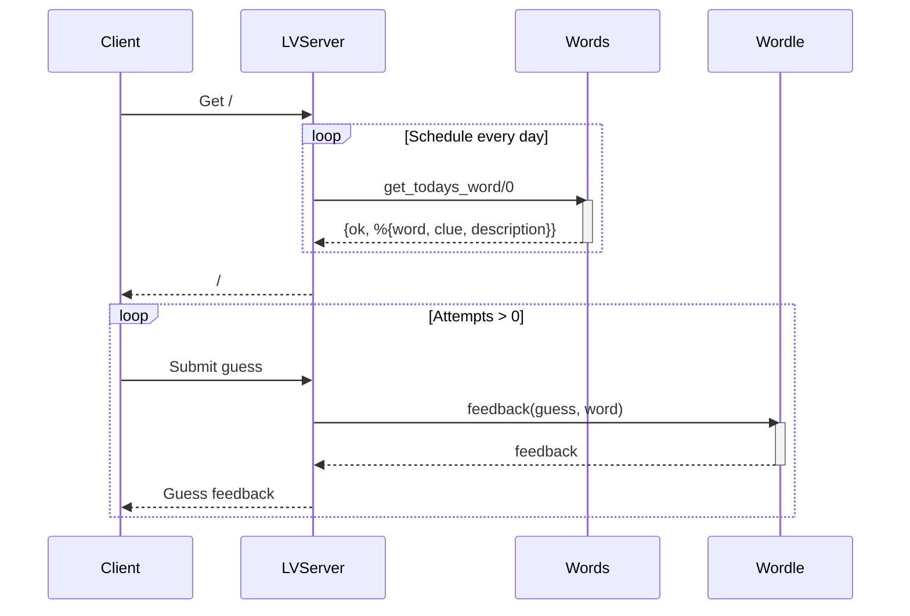

# Table of contents

- [Diagrams](#diagrams)
  1. [Flow diagram](#flow-diagram)
  2. [Sequence diagram](#sequence-diagram)

- [Mockups](#mockups)
- [Future ideas](#future-ideas)

## Diagrams

### Flow diagram

Main flow of the page per each day word:



### Sequence diagram

Main sequence of the page, including layers interaction (browser, endpoints, db):



## Mockups

|  |  |
| -- | -- |

For the MVP feature like setting the language, color-blind model, keyboard feedback, only valid words and dark theme, are not necessary.

### Frontend Screenshots  (responsive)

Table displaying wallaby screenshots with 640px width:

|  |   |
| -- | -- |
|  |  |

To examine additional widths, please refer to the [screenshots folder](./images/screenshots/).

[Wallaby](https://github.com/elixir-wallaby/wallaby) is used for end-to-end testing and for taking these screenshots (with Chrome drivers).

To produce the screenshots and evaluate client-server cross-functional behaviors comprehensively:

```elixir
mix test --only wallaby
```

### Future ideas

Take into account ...

- Words considered valid are extracted using regex from a specific version of the [Elixir repository](https://github.com/elixir-lang/elixir/tags), specified in the [.env](/.env) file.
